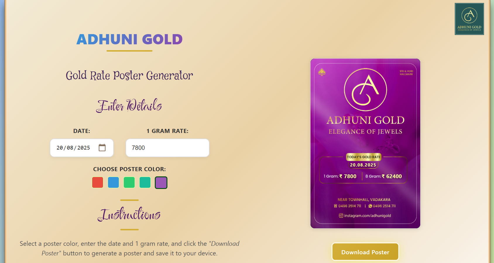

# 🖼️ Adhuni Gold – Poster Generator

A **React-based web application** that allows Adhuni Gold employees to quickly generate professional gold rate posters with customisable date & rates. Users can enter the date and gold rates. Select from multiple poster colour themes, preview the result, and download a high-resolution poster as an image.

This project was built for a local gold jewellery shop named **Adhuni Gold** to streamline poster creation and avoid manual editing every single day.

**Live Project**:

[](https://adhunigold-rate.vercel.app/)

---

## ✨ Features

- 🖼️ **Poster Templates**
    
    Choose from 5 pre-designed poster backgrounds (different colour themes).
    
- 🎨 **Colour Picker UI**
    
    Select poster design using **colour swatches** (with active state highlighting).
    
- 🗓️ **Customisable Inputs**
    - Date selector (with default to today).
    - Input for 1 gram gold rate (8g value calculated automatically).
    - Input for change in gold rate.
- ⚡ **Preview with Skeleton Loader**
    
    Poster preview updates instantly with shimmer animation while templates load.
    
- 📥 **High-Resolution Download**
    
    Uses **html2canvas** to generate a 2x scaled PNG file for sharp high-quality posters.
    
- 🔄 **Optimised Loading**
    
    Only loads poster images **on demand** (avoids downloading all heavy images at once).
    
- 🖌️ **Branding Support**
    
    Company logo placed neatly on the card (top-center).
    

---

## 🛠️ Tech Stack

- **React.js** – Frontend framework
- **html2canvas** – HTML → Canvas → PNG export
- **CSS3** – Custom styling (no Tailwind/Bootstrap used)

---

## 📂 Project Structure

```
adhuni-gold-poster/
│
├── public/
│   ├── index.html
│   └── templates/
│       ├── poster-red.jpg
│       ├── poster-blue.jpg
│       ├── poster-green.jpg
│       ├── poster-gold.jpg
│       └── poster-purple.jpg
│
├── src/
│   ├── App.jsx         # Main app logic
│   ├── App.css         # Styles
│   ├── templates.js    # Poster colour + src mapping
│   ├── assets/
│   │   └── App Logo.jpg
│   └── index.js
│
├── package.json
└── README.md

```

---

## 🚀 Installation & Setup

1. **Clone the repo**
    
    ```bash
    git clone https://github.com/thajucp123/adhunigold-rate-generator.git
    cd adhunigold-rate-generator
    
    ```
    
2. **Install dependencies**
    
    ```bash
    npm install
    
    ```
    
3. **Run development server**
    
    ```bash
    npm run dev
    
    ```
    
    App will be available at 👉 `http://localhost:5173`
    <br/>
4. **Build for production**
    
    ```bash
    npm run build
    
    ```
    

---

## 🎯 Usage

1. Select **poster colour** from the swatches.
2. Enter the **date**, **1 gram rate** and **change**.
3. The **8 gram rate** updates automatically.
4. Click **Download Poster** → Saves a **high-resolution PNG** file to your device.

---

## 📸 Screenshots




---

## ⚙️ Future Improvements

- [ ]  Add more poster templates (festivals, offers, seasonal themes).
- [ ]  Multi-language support (Malayalam / Hindi).
- [ ]  Option to upload **custom background templates**.
- [ ]  Auto-scheduled poster generation.

---

## 🤝 Contributing

1. Fork the project
2. Create a new feature branch (`git checkout -b feature/amazing-feature`)
3. Commit changes (`git commit -m 'Add amazing feature'`)
4. Push to branch (`git push origin feature/amazing-feature`)
5. Open a Pull Request

---

## 📜 License

This project is licensed under the **MIT License** – feel free to modify and adapt for your needs.

---

## 👤 Author

**Thaju CP**

🚀 Aspiring Software Dev → info@thajucp.in

💡 Interests: coding, astronomy, science, photography, gaming

🅿️ Portfolio: www.thajucp.in